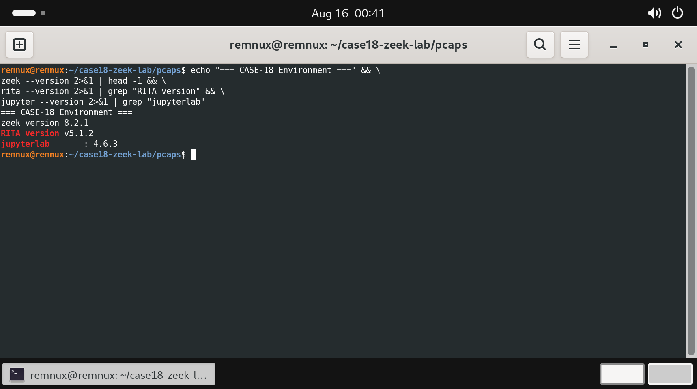
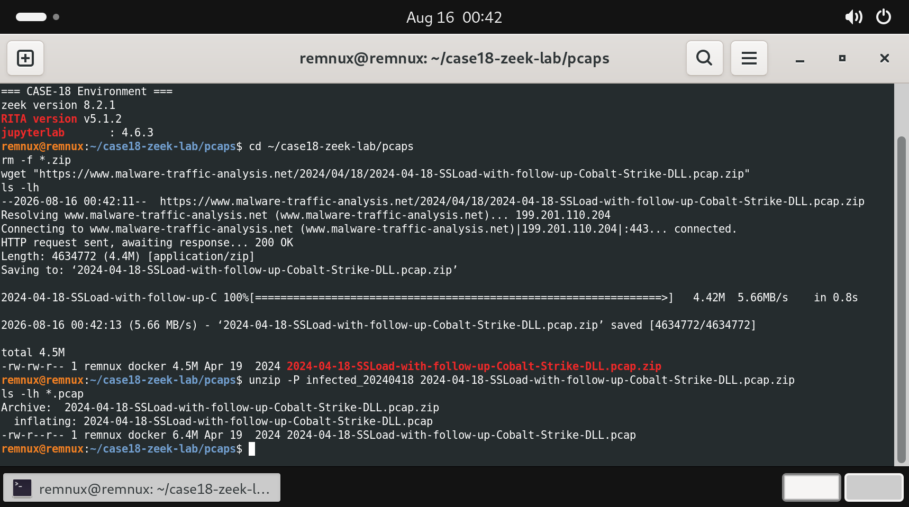
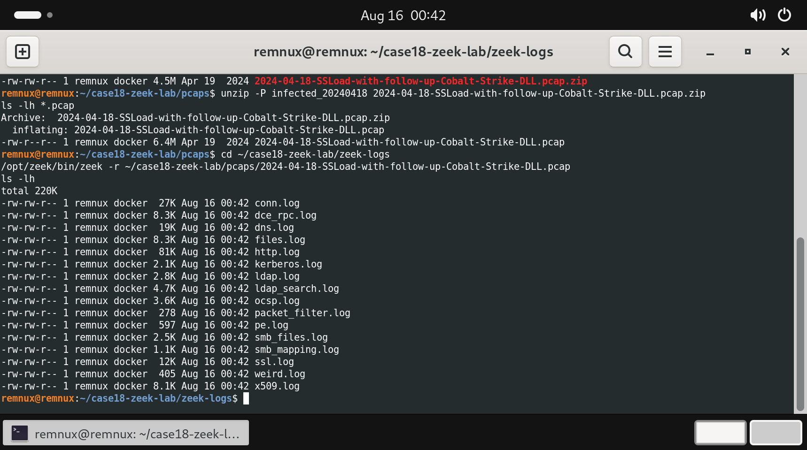
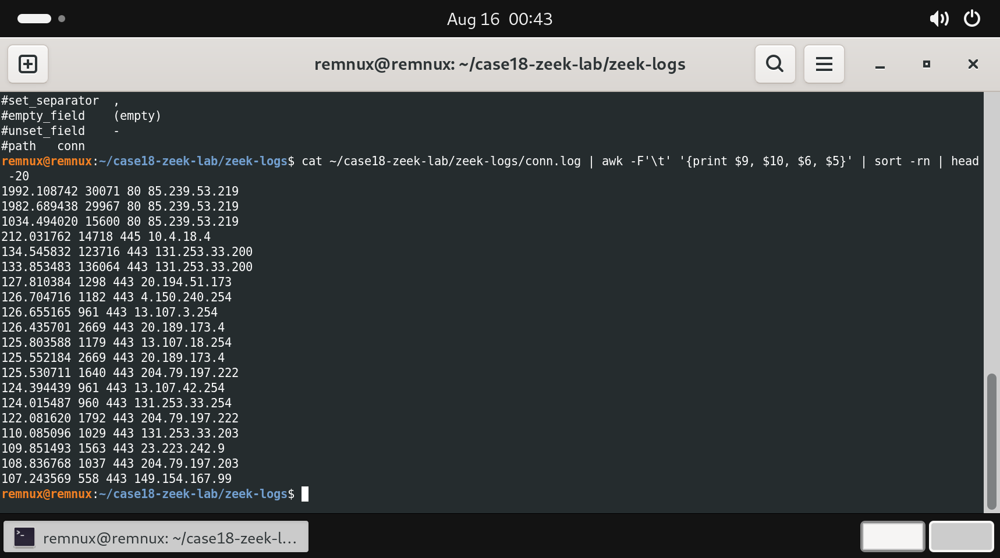
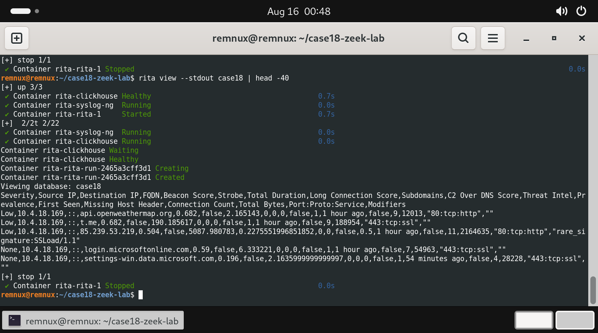
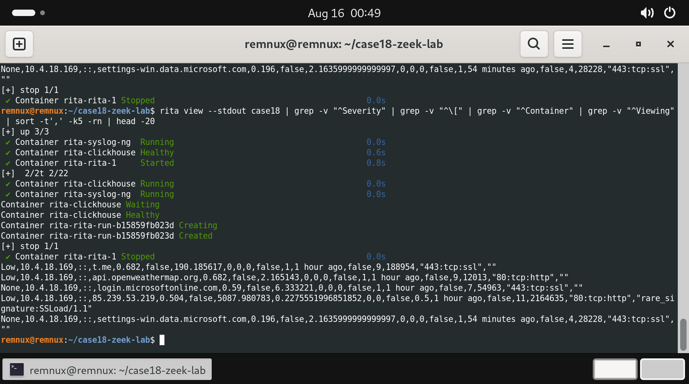
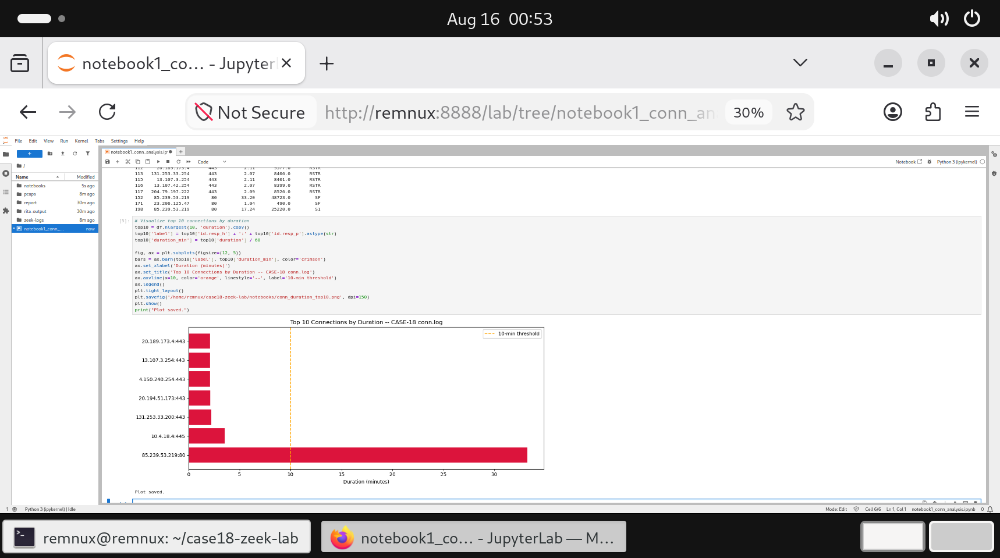
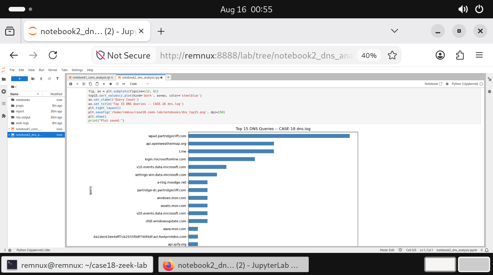
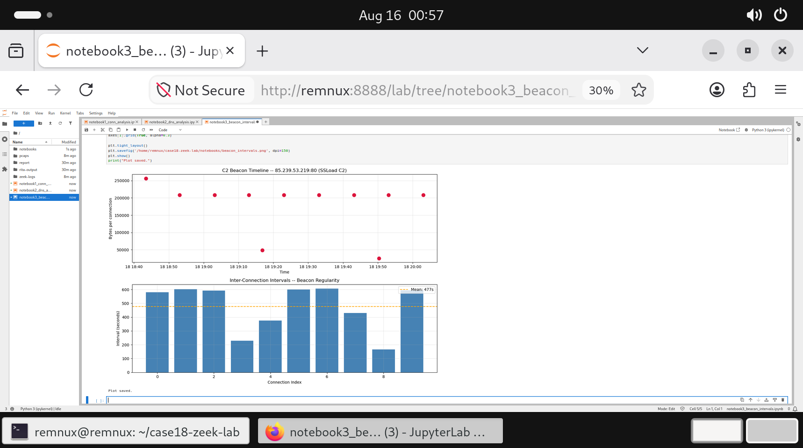

# CASE-18: Zeek Network Forensics + Beacon Detection

**Real-world C2 beacon detection using Zeek 8.2.1, RITA v5.1.2, and Jupyter threat hunting notebooks against a live SSLoad + Cobalt Strike PCAP.**

[](https://zeek.org)
[](https://github.com/activecm/rita)
[](https://python.org)
[](https://remnux.org)

---

## Overview

This lab demonstrates end-to-end network forensics and C2 beacon detection using open-source tools. A real malware PCAP containing SSLoad infection traffic with follow-on Cobalt Strike DLL activity (sourced from Malware Traffic Analysis, April 18, 2024) was analyzed to identify, score, and document active command-and-control communication.

The analysis confirmed 85.239.53.219 as the primary C2 server with a mean beacon interval of 477 seconds, auto-tagged by RITA as `rare_signature:SSLoad/1.1`. Secondary C2 candidates including api.openweathermap.org and t.me (Telegram) were identified through RITA's beacon scoring at 0.682.

---

## Key Findings

| Indicator | Value |
|---|---|
| C2 Server | 85.239.53.219:80 (HTTP) |
| Beacon Score (RITA) | 0.504 |
| RITA Modifier | `rare_signature:SSLoad/1.1` |
| Total C2 Connections | 11 |
| Mean Beacon Interval | 477 seconds (~8 minutes) |
| Total C2 Duration | 5,087 seconds (~84 minutes) |
| Victim Host | 10.4.18.169 |
| DNS Queries | 73 total |
| HTTP Requests | 273 total |
| Zeek Logs Generated | 17 files (220KB) |

---

## Environment

| Component | Version |
|---|---|
| OS | REMnux Ubuntu 24.04 |
| Zeek | 8.2.1 |
| RITA | v5.1.2 (Docker + ClickHouse) |
| JupyterLab | 4.6.3 |
| Docker | 29.7.2 |
| Python | 3.12 |
| Host | Windows 11, VMware Workstation, VMnet2 host-only (192.168.100.0/24) |

---

## PCAP Source

**Malware Traffic Analysis -- 2024-04-18: Word macro --> SSLoad --> Cobalt Strike DLL**

- Source: [malware-traffic-analysis.net/2024/04/18/](https://www.malware-traffic-analysis.net/2024/04/18/)
- File: `2024-04-18-SSLoad-with-follow-up-Cobalt-Strike-DLL.pcap`
- Size: 6.4MB
- Password scheme: `infected_YYYYMMDD` (see MTA about page)

---

## Repository Structure

```
zeek-network-forensics-lab/
├── pcaps/
│   └── 2024-04-18-SSLoad-with-follow-up-Cobalt-Strike-DLL.pcap
├── zeek-logs/
│   ├── conn.log
│   ├── dns.log
│   ├── http.log
│   ├── ssl.log
│   ├── files.log
│   ├── kerberos.log
│   ├── ldap.log
│   └── ...
├── notebooks/
│   ├── notebook1_conn_analysis.ipynb
│   ├── notebook2_dns_analysis.ipynb
│   ├── notebook3_beacon_intervals.ipynb
│   ├── conn_duration_top10.png
│   ├── dns_top15.png
│   └── beacon_intervals.png
├── phase-6-report/
│   └── CASE-18_Network_Forensics_Investigation_Report.pdf
├── screenshots/
│   ├── 01_zeek_rita_versions.png
│   ├── 02_pcap_verified.png
│   ├── 03_zeek_logs_generated.png
│   ├── 04_conn_log_suspicious.png
│   ├── 05_rita_beacon_scoring.png
│   ├── 06_rita_top_beacons.png
│   ├── 07_notebook1_conn_analysis.png
│   ├── 08_notebook2_dns_analysis.png
│   ├── 09_notebook3_beacon_intervals.png
│   └── 10_report_cover_page.png
└── README.md
```

---

## Phase Walkthrough

### Phase 1 -- Environment Setup

Installed Zeek from the official openSUSE repository for Ubuntu 24.04, RITA v5.1.2 via the tarball installer (requires Docker Engine), and JupyterLab via pip3.

```bash
# Zeek
echo 'deb http://download.opensuse.org/repositories/security:/zeek/xUbuntu_24.04/ /' \
  | sudo tee /etc/apt/sources.list.d/zeek.list
sudo apt-get update && sudo apt-get install -y zeek
echo 'export PATH=$PATH:/opt/zeek/bin' >> ~/.bashrc

# RITA
wget https://github.com/activecm/rita/releases/download/v5.1.2/rita-v5.1.2.tar.gz
tar -xzvf rita-v5.1.2.tar.gz
cd rita-v5.1.2-installer && ./install_rita.sh localhost

# Jupyter
pip3 install jupyter pandas matplotlib seaborn --break-system-packages
```



---

### Phase 2 -- PCAP Acquisition

```bash
mkdir -p ~/case18-zeek-lab/{pcaps,zeek-logs,rita-output,notebooks,report}
cd ~/case18-zeek-lab/pcaps
wget "https://www.malware-traffic-analysis.net/2024/04/18/2024-04-18-SSLoad-with-follow-up-Cobalt-Strike-DLL.pcap.zip"
unzip -P infected_20240418 2024-04-18-SSLoad-with-follow-up-Cobalt-Strike-DLL.pcap.zip
```



---

### Phase 3 -- Zeek Analysis

```bash
cd ~/case18-zeek-lab/zeek-logs
/opt/zeek/bin/zeek -r ~/case18-zeek-lab/pcaps/2024-04-18-SSLoad-with-follow-up-Cobalt-Strike-DLL.pcap
ls -lh
```

Zeek generated 17 structured log files. Key logs for C2 detection:

- `conn.log` (27K) -- all connections with duration, bytes, state
- `http.log` (81K) -- 273 HTTP requests including SSLoad callbacks
- `dns.log` (19K) -- 73 DNS queries including dead drop domains
- `ssl.log` (12K) -- TLS sessions including Cobalt Strike HTTPS beacon
- `kerberos.log` + `ldap.log` -- post-exploitation AD enumeration



Sorting conn.log by duration immediately surfaces the C2 server:

```bash
cat ~/case18-zeek-lab/zeek-logs/conn.log | awk -F'\t' '{print $9, $10, $6, $5}' | sort -rn | head -20
```



---

### Phase 4 -- RITA Beacon Scoring

```bash
rita import --database case18 --logs /home/remnux/case18-zeek-lab/zeek-logs
rita view --stdout case18
```

RITA scored all external connections for beaconing regularity using interval skewness analysis, data size consistency, and connection count. Scores above 0.5 warrant investigation.



Top beacons ranked by score:

| Destination | Beacon Score | Connections | Verdict |
|---|---|---|---|
| t.me | 0.682 | 9 | Fallback C2 / exfil channel |
| api.openweathermap.org | 0.682 | 9 | Dead drop resolver |
| 85.239.53.219 | **0.504** | **11** | **Primary C2 -- SSLoad/1.1** |



---

### Phase 5 -- Threat Hunting Notebooks

**Notebook 1 -- conn.log analysis**

Parsed conn.log with pandas, identified top 15 longest connections, flagged C2 candidates by long duration + low bytes + external IP pattern.



---

**Notebook 2 -- DNS analysis**

Parsed dns.log, counted query frequency per domain. wpad.partridgecliff.com top queried (WPAD probe). api.openweathermap.org and t.me flagged as high-frequency external queries.



---

**Notebook 3 -- Beacon interval visualization**

Isolated all 11 connections to 85.239.53.219, computed inter-arrival intervals. Mean: 477s, Std dev: ~119s, Jitter: ~25% -- consistent with a configured Cobalt Strike sleep timer.



---

### Phase 6 -- Investigation Report

Full PDF report mapping all findings to MITRE ATT&CK, with IOC table, Sigma detection rules, and network control recommendations.


---

## MITRE ATT&CK

| Technique | Name | Evidence |
|---|---|---|
| T1071 | Application Layer Protocol | SSLoad C2 over HTTP port 80; 273 HTTP requests |
| T1071.004 | DNS C2 | High-frequency queries to api.openweathermap.org and t.me |
| T1008 | Fallback Channels | t.me and api.openweathermap.org as parallel C2 channels |
| T1095 | Non-Application Layer Protocol | Cobalt Strike HTTPS beacon in ssl.log |
| T1557 | Adversary-in-the-Middle | WPAD probe for proxy interception |
| T1018 | Remote System Discovery | Domain controller DNS lookup -- AD enumeration |

---

## IOCs

| Type | Value | Context |
|---|---|---|
| IP | 85.239.53.219 | SSLoad C2 -- port 80 HTTP -- beacon score 0.504 |
| IP | 10.4.18.169 | Victim host |
| Domain | api.openweathermap.org | Dead drop resolver -- beacon score 0.682 |
| Domain | t.me | Telegram -- fallback C2 -- beacon score 0.682 |
| Domain | wpad.partridgecliff.com | WPAD probe -- proxy discovery |
| Domain | partridge-dc.partridgecliff.com | Domain controller -- AD enumeration |
| User Agent | SSLoad/1.1 | SSLoad malware HTTP user agent |
| Port | 80/tcp | Primary C2 port |
| Port | 445/tcp | SMB lateral movement to 10.4.18.4 |
| Beacon Interval | 477 seconds | Cobalt Strike sleep timer |

---

## Detection Logic

```yaml
title: SSLoad C2 Beacon via HTTP
id: case18-001
status: experimental
logsource:
  product: zeek
  service: conn
detection:
  selection:
    proto: tcp
    id.resp_p: 80
    duration|gt: 600
    orig_bytes|lt: 5000
  condition: selection
level: high
tags:
  - attack.t1071
```

```yaml
title: High-Frequency DNS to Non-Corporate Domain
id: case18-002
status: experimental
logsource:
  product: zeek
  service: dns
detection:
  selection:
    qtype_name: A
  timeframe: 10m
  condition: selection | count(query) by query > 8
level: medium
tags:
  - attack.t1071.004
```

---

## Tools Used

| Tool | Purpose |
|---|---|
| Zeek 8.2.1 | Network traffic parsing and structured log generation |
| RITA v5.1.2 | Probabilistic beacon scoring via ClickHouse analytics |
| pandas | Log parsing and data manipulation |
| matplotlib | Connection timeline and interval visualization |
| JupyterLab 4.6.3 | Interactive threat hunting notebooks |
| Docker 29.7.2 | RITA backend container orchestration |
| ReportLab | PDF investigation report generation |

---

## References

- [Malware Traffic Analysis 2024-04-18](https://www.malware-traffic-analysis.net/2024/04/18/)
- [RITA by Active Countermeasures](https://github.com/activecm/rita)
- [Zeek Network Security Monitor](https://zeek.org)
- [MITRE ATT&CK T1071](https://attack.mitre.org/techniques/T1071/)
- [MITRE ATT&CK T1008](https://attack.mitre.org/techniques/T1008/)

---

## Author

**Ronan Kongala**
MS Cybersecurity, Northeastern University (GPA 3.8)
Cybersecurity Intern (AI/ML), Abbott (Exact Sciences)

[LinkedIn](https://linkedin.com/in/ronan-kongala) | [GitHub](https://github.com/ronankongala) | [Portfolio](https://ronankongala.github.io)
