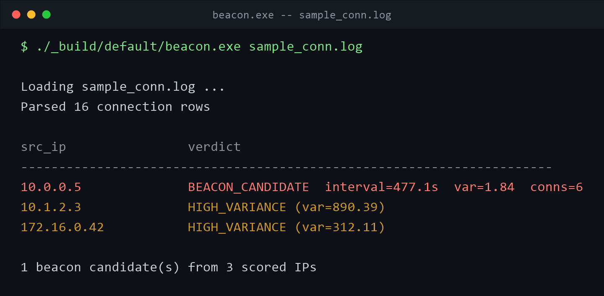
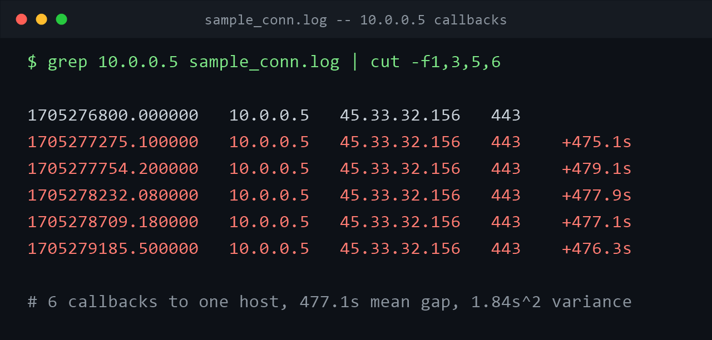

# CASE-18 — Zeek Beacon Detector (OCaml)

**CASE-17 ported to OCaml** — the same beacon-detection logic I built in Python using Zeek + RITA, reimplemented functionally to explore the differences between an imperative and a functional approach to the same problem.

## What it does

Reads a Zeek `conn.log`, groups connections by source IP, computes inter-arrival interval variance for each IP, and flags low-variance periodic senders as beacon candidates — the same signal RITA uses to identify C2 beaconing. Beacon candidates are shown first in the output, sorted by ascending variance (most suspicious first); all other scored IPs follow for context.



Of the 16 parsed rows, 3 source IPs clear the 5-connection minimum and get scored.
Only `10.0.0.5` lands under the 5.0 variance threshold, at 1.84.

### The signal it keys on

`10.0.0.5` calls back to `45.33.32.156:443` six times, with gaps of 475.1s,
479.1s, 477.9s, 477.1s and 476.3s -- a 477.1s mean with only 4.0s between the
shortest and longest gap. The two noisy hosts sit at variance 890.39 and 312.11,
178x and 62x above the 5.0 threshold.



## Project structure

```
zeek-network-forensics-lab/
├── beacon.ml        ← single-file implementation
├── dune             ← build target
├── dune-project     ← dune version pin
├── sample_conn.log  ← synthetic Zeek log: one beacon, two noisy talkers
├── docs/screenshots/← terminal captures used in this README
└── README.md
```

## Setup and build

Requires [opam](https://opam.ocaml.org/) and OCaml ≥ 4.04.

```bash
# macOS
brew install opam && opam init && eval $(opam env)

# Ubuntu / Debian
sudo apt-get install opam && opam init && eval $(opam env)

# Install dune and build
opam install dune
cd zeek-network-forensics-lab
dune build
```

No output from `dune build` means success. The binary is at
`_build/default/beacon.exe` (dune uses `.exe` on all platforms).

## Running

```bash
# Against the sample log
./_build/default/beacon.exe sample_conn.log

# Against your own Zeek conn.log
./_build/default/beacon.exe /path/to/conn.log
```

Running against the real CASE-17 conn.log should flag the original C2 host with
low variance, matching what RITA found — same logic, different language.

## Pipeline

```
load_conn_log   → conn_row list               (parse_line filters #-headers)
group_by_src    → StrMap (ip → conn_row list) (Map.Make, O(n log k))
  per IP:
    sort ts     → float list
    intervals   → float list                  (consecutive gaps)
    variance    → float                       (population variance of gaps)
    threshold   → beacon_verdict
  wrap with ip  → scored_ip
print_results   → stdout                      (candidates first, then rest)
```

Parameters: `min_conns = 5` (minimum hits required to score an IP),
`variance_thresh = 5.0` seconds² (flag as beacon candidate if below this).

## What changed vs. CASE-17 (Python)

| CASE-17 (Python) | CASE-18 (OCaml) |
|---|---|
| `dict` keyed by src IP | `Map.Make(String)` — O(log k) per lookup |
| `for` loop over rows, mutating dict | `List.fold_left` — state explicit in accumulator |
| `if/elif` on field values | `match fields with` — exhaustiveness checked at compile time |
| `KeyError` at runtime for bad field | `None` from `try ... with Failure _` — caller handles it |
| Mutable stats computed in-place | `mean`, `variance` are pure functions over lists |
| `if score < threshold: flag()` | `BeaconCandidate { ... }` variant — caller can't skip the check |

### The thing I liked most about OCaml

The `beacon_verdict` variant type makes it impossible to have a "not yet scored"
IP reach the output printer. In Python, I had a separate sentinel value and an
`assert` to catch cases where scoring was skipped. In OCaml, the type system
makes that state structurally unrepresentable — the printer receives a
`beacon_verdict`, which by construction is one of the three cases, always.

### What was hard

Getting inter-arrival intervals right without mutation. The Python version just
sorted a list in-place and iterated with an index. In OCaml, I wrote a recursive
function that consumes the list pairwise — cleaner once I had it, but the mental
model took a few iterations.

### What I'd do next

- Add a `-port` filter flag to restrict scoring to a specific destination port
- Stream rather than loading the whole file into memory first
- For very large logs (multi-GB), swap `Map.Make` for `Hashtbl` — O(log k) vs
  O(1) amortized per lookup matters at scale

## Relation to portfolio

- **CASE-17** (Python): [zeek-beacon-ocaml](https://github.com/ronankongala/zeek-beacon-ocaml) — original investigation on a real 6.4MB SSLoad + Cobalt Strike PCAP
- **CASE-18** (this repo): functional rewrite of the core beacon-scoring logic in OCaml
- **Full portfolio**: [ronankongala.github.io](https://ronankongala.github.io)
