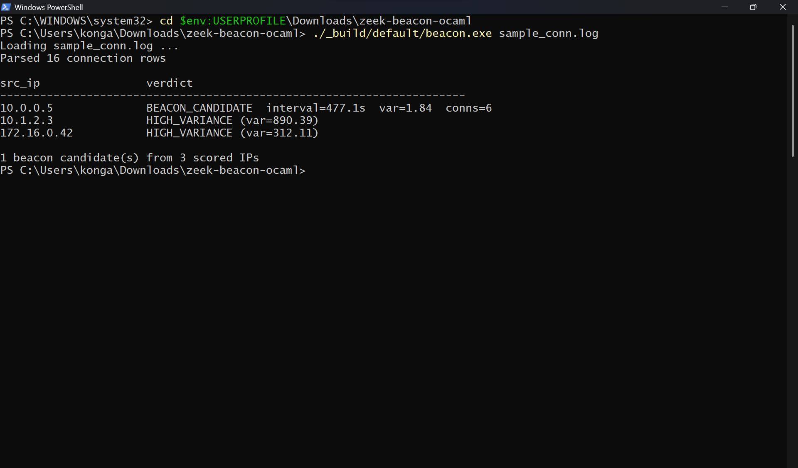
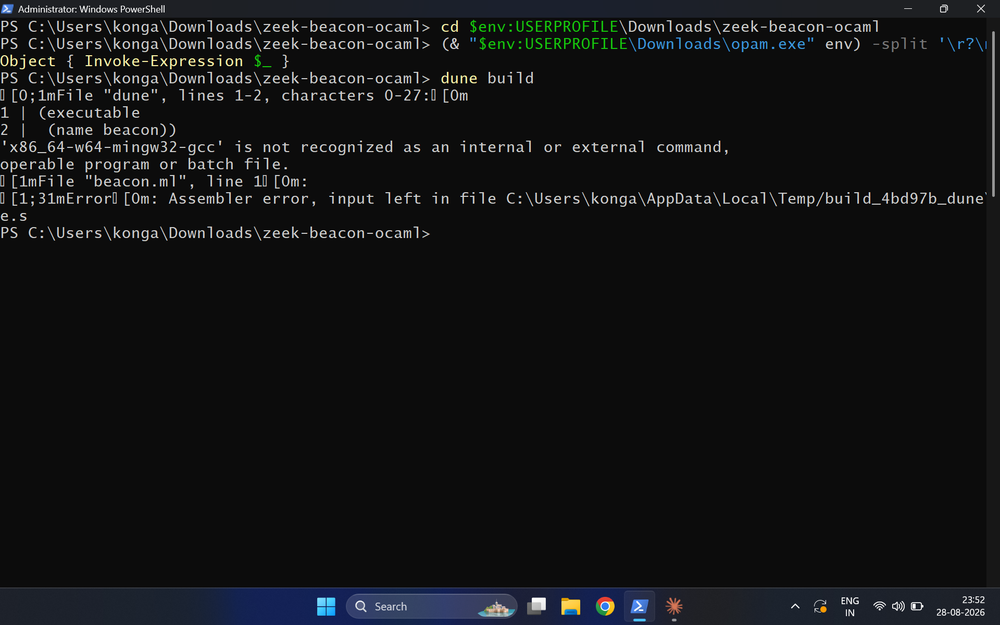
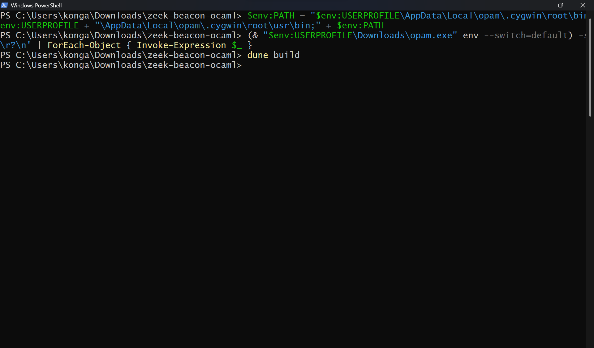

# CASE-18: Zeek Beacon Detector (OCaml)

**CASE-17, ported to OCaml.** It reimplements the beacon-detection logic I built in Python with Zeek and RITA, so I could compare an imperative and a functional take on the same problem.

## What it does

Reads a Zeek `conn.log`, groups connections by source IP, computes inter-arrival interval variance for each IP, and flags low-variance periodic senders as beacon candidates. RITA keys on the same signal to find C2 beaconing. Beacon candidates are shown first in the output, sorted by ascending variance (most suspicious first); all other scored IPs follow for context.



Of the 16 parsed rows, 3 source IPs clear the 5-connection minimum and get scored.
Only `10.0.0.5` lands under the 5.0 variance threshold, at 1.84.

### The signal it keys on

`10.0.0.5` calls back to `45.33.32.156:443` six times. Pulling just the timestamp,
source, destination and port columns out of the log shows why it scores the way it does:

```bash
$ grep 10.0.0.5 sample_conn.log | cut -f1,3,5,6
1705276800.000000   10.0.0.5   45.33.32.156   443
1705277275.100000   10.0.0.5   45.33.32.156   443     +475.1s
1705277754.200000   10.0.0.5   45.33.32.156   443     +479.1s
1705278232.080000   10.0.0.5   45.33.32.156   443     +477.9s
1705278709.180000   10.0.0.5   45.33.32.156   443     +477.1s
1705279185.500000   10.0.0.5   45.33.32.156   443     +476.3s
```

A 477.1s mean with only 4.0s between the shortest and longest gap. The two noisy
hosts sit at variance 890.39 and 312.11, which is 178x and 62x above the 5.0
threshold.

## Project structure

```
zeek-beacon-ocaml/
├── beacon.ml        ← single-file implementation
├── dune             ← build target
├── dune-project     ← dune version pin
├── sample_conn.log  ← synthetic Zeek log: one beacon, two noisy talkers
├── docs/screenshots/← terminal captures used in this README
└── README.md
```

## Setup and build

Requires [opam](https://opam.ocaml.org/) and OCaml ≥ 4.04.

```bash
# macOS
brew install opam && opam init && eval $(opam env)

# Ubuntu / Debian
sudo apt-get install opam && opam init && eval $(opam env)

# Install dune and build
opam install dune
cd zeek-beacon-ocaml
dune build
```

No output from `dune build` means success. The binary is at
`_build/default/beacon.exe` (dune uses `.exe` on all platforms).

### Building on Windows

The first build failed. `dune` found the OCaml compiler but not the C toolchain
it shells out to for assembly, so the compile got as far as generating a `.s`
file and then died:



```
'x86_64-w64-mingw32-gcc' is not recognized as an internal or external command
Error: Assembler error, input left in file ...build_4bd97b_dune/...e.s
```

The gcc that opam installs lives inside opam's own Cygwin root, which is not on
the PowerShell `PATH`. Adding those two directories, then re-importing the opam
environment, fixes it:

```powershell
$env:PATH = "$env:USERPROFILE\AppData\Local\opam\.cygwin\root\bin;" +
            "$env:USERPROFILE\AppData\Local\opam\.cygwin\root\usr\bin;" + $env:PATH
(& "$env:USERPROFILE\Downloads\opam.exe" env --switch=default) -split '\r?\n' |
    ForEach-Object { Invoke-Expression $_ }
dune build
```



Silent return, which is what a successful `dune build` looks like.

## Running

```bash
# Against the sample log
./_build/default/beacon.exe sample_conn.log

# Against your own Zeek conn.log
./_build/default/beacon.exe /path/to/conn.log
```

I haven't run it against the CASE-17 conn.log yet (that log isn't committed in either repo), so the sample log is the only tested input.

## Pipeline

```
load_conn_log   → conn_row list               (parse_line filters #-headers)
group_by_src    → StrMap (ip → conn_row list) (Map.Make, O(n log k))
  per IP:
    sort ts     → float list
    intervals   → float list                  (consecutive gaps)
    variance    → float                       (population variance of gaps)
    threshold   → beacon_verdict
  wrap with ip  → scored_ip
print_results   → stdout                      (candidates first, then rest)
```

Parameters: `min_conns = 5` (minimum hits required to score an IP),
`variance_thresh = 5.0` seconds² (flag as beacon candidate if below this).

## What changed vs. CASE-17 (Python)

| CASE-17 (Python) | CASE-18 (OCaml) |
|---|---|
| `dict` keyed by src IP | `Map.Make(String)`, O(log k) per lookup |
| `for` loop over rows, mutating dict | `List.fold_left`, state explicit in accumulator |
| `if/elif` on field values | `match fields with`, exhaustiveness checked at compile time |
| `KeyError` at runtime for bad field | `None` from `try ... with Failure _`, caller handles it |
| Mutable stats computed in-place | `mean`, `variance` are pure functions over lists |
| `if score < threshold: flag()` | `BeaconCandidate { ... }` variant, caller can't skip the check |

### The thing I liked most about OCaml

The `beacon_verdict` variant type makes it impossible to have a "not yet scored"
IP reach the output printer. In Python, I had a separate sentinel value and an
`assert` to catch cases where scoring was skipped. In OCaml, the type system
makes that state unrepresentable. The printer only ever receives a
`beacon_verdict`, and that is always one of the three cases.

### What was hard

Getting inter-arrival intervals right without mutation. The Python version just
sorted a list in-place and iterated with an index. In OCaml, I wrote a recursive
function that consumes the list pairwise. It reads cleaner than the Python, but it
took me a few tries to get right.

### What I'd do next

- Add a `-port` filter flag to restrict scoring to a specific destination port
- Stream rather than loading the whole file into memory first
- For multi-GB logs, swap `Map.Make` for `Hashtbl`. At that size, O(1) amortized
  lookups beat O(log k).

## Relation to portfolio

- **CASE-17** (Python): [zeek-network-forensics-lab](https://github.com/ronankongala/zeek-network-forensics-lab), the original investigation on a 6.4MB SSLoad + Cobalt Strike PCAP
- **CASE-18** (this repo): functional rewrite of the core beacon-scoring logic in OCaml
- **Full portfolio**: [ronankongala.github.io](https://ronankongala.github.io)
